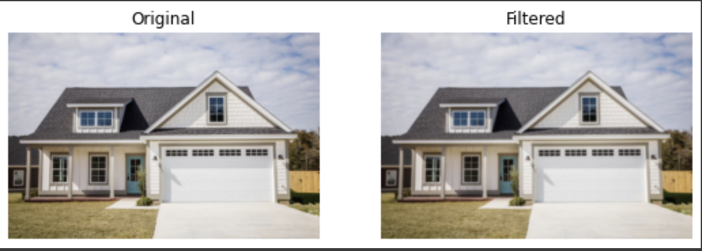
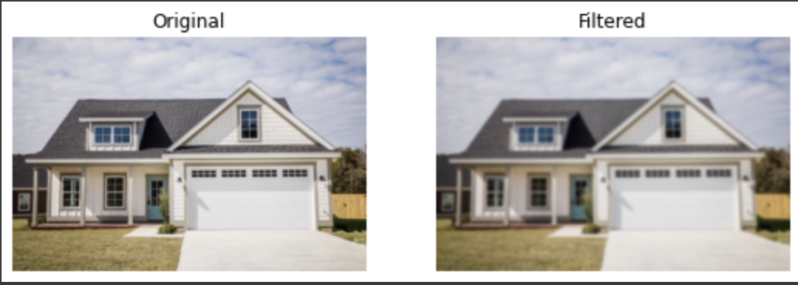
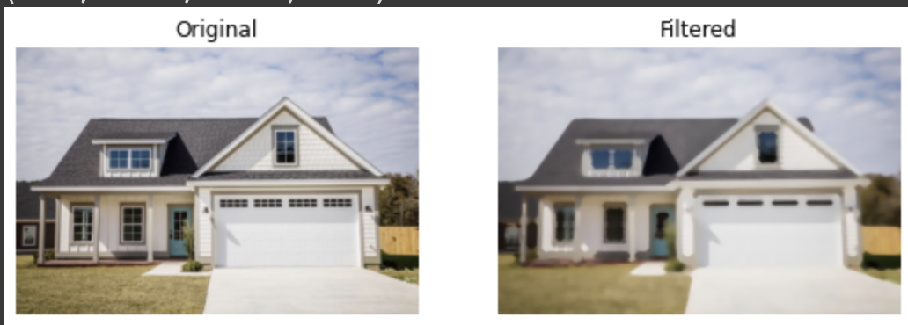
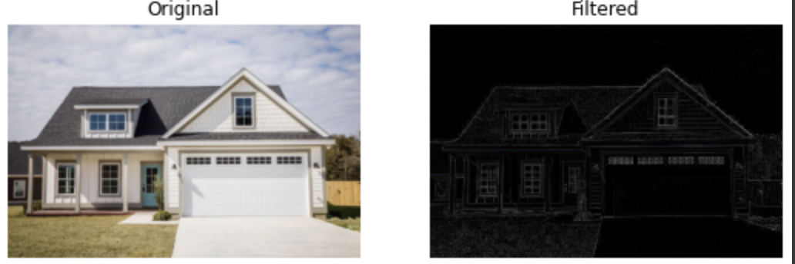
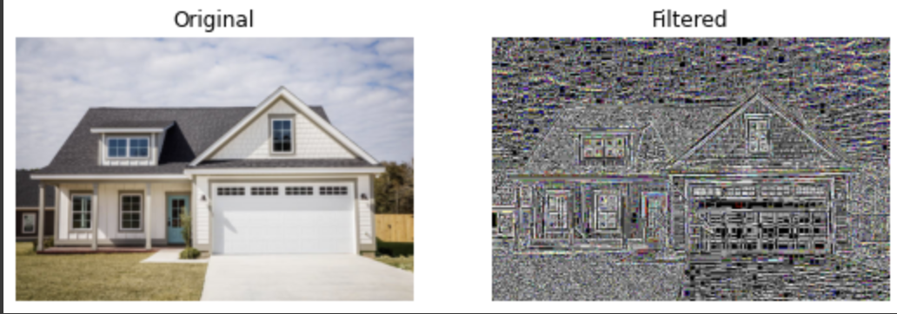

# Implementation-of-Filters
## Aim:
To implement filters for smoothing and sharpening the images in the spatial domain.

## Software Required:
Anaconda - Python 3.7

## Algorithm:
### Step1 :- Import the required modules.
</br>
</br> 

### Step2 :- Convert the image from BGR to RGB. 
</br>
</br> 

### Step3:- Apply the required filters for the image separately. 
</br>
</br> 

### Step4:- Plot the original and filtered image by using matplotlib.pyplot
</br>
</br> 

### Step5:- End the program. 
</br>
</br> 

## Program:
### Developed By   :Vivekananda Reddy
### Register Number:212221240030
</br>

### 1. Smoothing Filters

i) Using Averaging Filter
```Python
import cv2
import numpy as np
import matplotlib.pyplot as plt
image = cv2.imread("house.jpeg")
original_image = cv2.cvtColor(image,cv2.COLOR_BGR2RGB)

kernel1 = np.ones((11,11),np.float32)/121
avg_filter = cv2.filter2D(original_image,-1,kernel1)
plt.figure(figsize = (9,9))
plt.subplot(1,2,1)
plt.imshow(original_image)
plt.title("Original")
plt.axis("off")
plt.subplot(1,2,2)
plt.imshow(avg_filter)
plt.title("Filtered")
plt.axis("off")


```
ii) Using Weighted Averaging Filter
```Python
kernel2 = np.array([[1,2,1],[2,4,2],[1,2,1]])/16
weighted_filter = cv2.filter2D(original_image,-1,kernel2)
plt.figure(figsize = (9,9))
plt.subplot(1,2,1)
plt.imshow(original_image)
plt.title("Original")
plt.axis("off")
plt.subplot(1,2,2)
plt.imshow(weighted_filter)
plt.title("Filtered")
plt.axis("off")


```
iii) Using Gaussian Filter
```Python
gaussian_blur = cv2.GaussianBlur(src = original_image, ksize = (11,11), sigmaX=0, sigmaY=0)
plt.figure(figsize = (9,9))
plt.subplot(1,2,1)
plt.imshow(original_image)
plt.title("Original")
plt.axis("off")
plt.subplot(1,2,2)
plt.imshow(gaussian_blur)
plt.title("Filtered")
plt.axis("off")


```

iv) Using Median Filter
```Python

median = cv2.medianBlur(src=original_image,ksize = 11)
plt.figure(figsize = (9,9))
plt.subplot(1,2,1)
plt.imshow(original_image)
plt.title("Original")
plt.axis("off")
plt.subplot(1,2,2)
plt.imshow(median)
plt.title("Filtered")
plt.axis("off")


```

### 2. Sharpening Filters
i) Using Laplacian Kernal
```Python

kernel3 = np.array([[0,1,0],[1,-4,1],[0,1,0]])
laplacian_kernel = cv2.filter2D(original_image,-1,kernel3)
plt.figure(figsize = (9,9))
plt.subplot(1,2,1)
plt.imshow(original_image)
plt.title("Original")
plt.axis("off")
plt.subplot(1,2,2)
plt.imshow(laplacian_kernel)
plt.title("Filtered")
plt.axis("off")


```
ii) Using Laplacian Operator
```Python

laplacian_operator = cv2.Laplacian(original_image,cv2.CV_64F)
plt.figure(figsize = (9,9))
plt.subplot(1,2,1)
plt.imshow(original_image)
plt.title("Original")
plt.axis("off")
plt.subplot(1,2,2)
plt.imshow(laplacian_operator)
plt.title("Filtered")
plt.axis("off")


```

## OUTPUT:
### 1. Smoothing Filters

i) Using Averaging Filter


ii) Using Weighted Averaging Filter


iii) Using Gaussian Filter


iv) Using Median Filter


### 2. Sharpening Filters

i) Using Laplacian Kernal


ii) Using Laplacian Operator


## Result:
Thus the filters are designed for smoothing and sharpening the images in the spatial domain.
